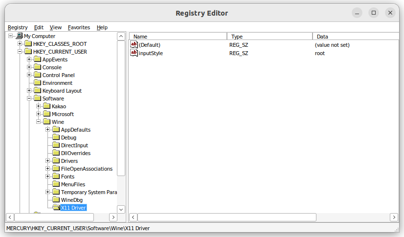

# Ubuntu 22.04 카카오톡 설치하기

Wine만을 사용하여 카카오톡을 설치한 경우, 카카오톡 로그인에 간헐적으로 실패하거나 메시지 목록을 불러오지 못하는 문제가 있었다. 이유는 모르겠지만 Lutris를 사용하면 이 문제가 해결되어 Lutris를 이용하였다.

## 한글 폰트 설치

카카오톡을 설치를 마치고 실행하면 한글이 정상적으로 출력되지 않을 것이다. 이 문제는 한글 폰트를 설치함으로써 해결할 수 있다. Lutris를 사용하여 카카오톡을 설치한 경로가 `$KAKAOTALK_PATH`라면, `$KAKAOTALK_PATH/drive_c/windows/Fonts`의 경로에 한글 폰트 파일을 넣어주면 된다. 필자는 맑은 고딕 폰트를 해당 경로에 넣었을 때 정상적으로 한글이 출력되었다.

## 한글 입력 문제

카카오톡 설치 완료 이후, 한글을 입력하면 중첩되어 입력되는 문제가 있었다. 이는 외부 자료를 참고하여 레지스트리 설정을 변경함으로써 해결할 수 있었다. 우선 Lutris를 실행한 후, 아래의 스크린샷과 같이 *Play* 버튼 옆의 메뉴 버튼을 클릭하여 *Wine registry*를 선택하거나, *Open Wine console*을 선택한 이후 `regedit`를 입력하여 레지스트기 편집기를 실행한다.


```
$ regedit
```

그 다음, `HKEY_CURRENT_USER/Software/Wine`에 하위 키 `X11 Driver`를 생성한다. 그리고 `HKEY_CURRENT_USER/Software/Wine/X11 Driver`에 문자열 값 `inputStyle`을 생성하고 그 값은 `root`로 설정해준다.



## References

[하모니카에서 카카오톡 한글 중복 입력문제 해결하기, HAMONI KR](https://hamonikr.org/used_hamonikr/82280)
